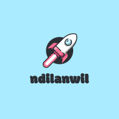

# Welcome to My Instagram
***

## Task
Create an Instagram Clone app : Using react js and host in the cloud
## Description
Our objectif is to create an instagram clone using react JS
Our main stacks for this app are react JS and firebase
Cloud Firestore is used to store users infos
Firebase storage was used to store the user files
To use the app a user must first login, the user interface is made in such a way that he gets easily used to the app

## Installation
- Clone the repository
- run npm install to install all dependencies
- run npm start and open your navigator to https://localhost:8080

                OR

- Go to https://instagram-ndilanwil.netlify.app

## Usage
After being to https://localhost:8080 or https://instagram-ndilanwil.netlify.app, Login if you are already a member, either you will need to sign up
After authentification, you will be directed to the home page. The first interface permits you to see all posts, then you can click on create to create your own post. You can equally add a comment, emoji to a post or even like a post by simply clicking on the heart Icon down the post.
Click on the username above a post to see his profile, you can the follow him or unfollow him if you already follow
Click on search button on the nav bar to search a user
To change your password, go to settings(the last button on the side nav)

### The Core Team

<i>Made by <a href='https://www.linkedin.com/in/nuadje-todjo-dilan-wilfred-80b50b220/'>Nuadje Dilan</a></i>
 

